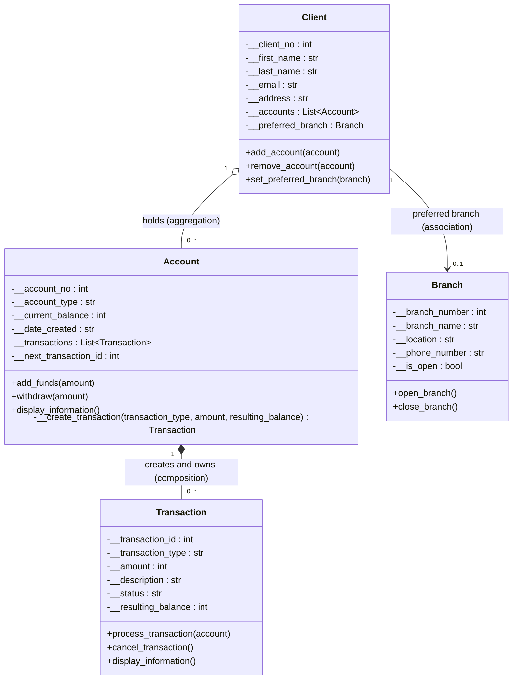

# Project 1: Finance System - UML Update (Workshop 4-2, Task 3)

Topic 4 update: Account now exposes properties (not shown in class
diagrams, as standard practice) and the Account-Transaction
relationship is now **composition**, because the account creates and
owns the transaction records made by its deposit and withdrawal
behaviour through a private helper method.

## What changed in Workshop 4-2

- **Account creates Transaction records** - the private helper
  `__create_transaction()` is reused by `add_funds()` and `withdraw()`,
  assigns each record a unique identifier, and records the transaction
  type, the amount, and the resulting balance.
- **Composition** - Transaction objects are created inside the Account
  (filled diamond) rather than independently in main.py. Invalid
  financial operations create no records.
- **Controlled read access** - the `transactions` property returns a
  copy of the private collection.
- **Properties** - `account_no`, `account_type` (read-write),
  `current_balance`, `date_created`, and `transactions` provide
  attribute-style access; identifiers and balances stay read-only and
  balance changes remain controlled by behaviour methods.
- Transaction itself gains a read-only `resulting_balance` field, set
  when the account records a completed movement of money.
